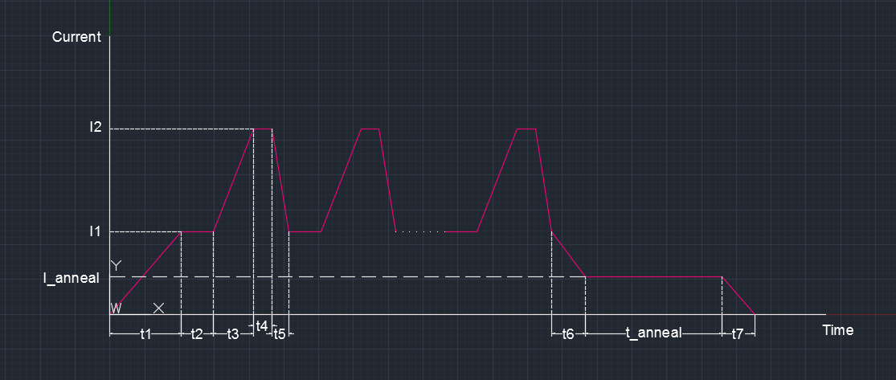

# Substrate heater control programs
## Introduction
The growth temperature is a key component to grow high-quality materials in Molecular Beam Epitaxy (MBE). However, manual control of current is challenging , and eventually often leads to grown materials with quality too poor to be further used.

In lots of labs, powers supplies used to control the growth temperature receive analog signals rather than computer-control-friendly digital signals (like power supply in my lab Delta Elektronika SM7020-D). In order to tackle this difficulty, versatile devices for measurement and control within simple analog and digital systems are perfect candidates for controlling power supplies through computers.

Here a data acquisition device [LabJack U3](https://labjack.com/products/u3) satisfying the above condition is adopted to precisely control the temperature. LabJack allows customization through default Python libraries, and Python programs here are developed based on these libraries to accurately control output current through LabJack using **feedback control**.

Typically, an exact time-series current curve needs to be specified for a heating or cooling process. The above figure shows a time-series current curve I use to grow bilayer graphene on Silicon Carbide. During the growth process, the whole curve is divided into events with certain durations. For each event, the current curve is specified by a linear curve with only initial current and final current required. The code "**time-series_current_curve_control.ipynb**" is developed to take two lists **t** and **current**. **t** is a list with end time points for all events. **current** is a list with all end currents for events (begin currents are not needed because the end current for the event now is the begin current for the next event.).

Also, for many cases, a time-series current curve can contain lots of cycle events (such as cycles shown in the middle of the schematic figure). "**Graphene_on_SiC_cycles_control.ipynb**" is developed with number of cycles provided as a part of inputs. 

## Dependencies
List of dependencies with the versions that were used for the data described on the manuscript:
* [Anaconda (v. 2.7)](https://www.anaconda.com/distribution/)
* [u3 (v. 2.0.0)](https://labjack.com/support/software/examples/ud/labjackpython): built-in python interface for LabJack U3
